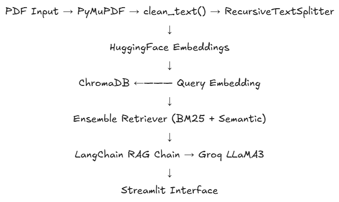

<div align="center">

# Technical Document Assistant


**RAG-powered Q&A system for technical PDFs — no tokenizer required**


[Demo](#demo) · [Architecture](#architecture) · [Quickstart](#quickstart) · [Benchmark](#benchmark) · [Roadmap](#roadmap)

</div>

***

## Overview

**Technical Document Assistant** is a local RAG (Retrieval-Augmented Generation) pipeline that lets you ask natural-language questions over technical PDFs — datasheets, academic papers, engineering reports — and receive grounded, source-cited answers in seconds.

The system combines **hybrid retrieval** (dense semantic search + BM25 lexical search) with **Groq's LLaMA 3** inference to deliver fast, accurate responses without hallucination. All embeddings and vector storage run locally; only the final LLM call hits the network.

Built as a portfolio project during the summer of 2026, this system demonstrates end-to-end RAG engineering: document ingestion, chunking strategy, retriever benchmarking, and a Streamlit chat interface.

***

## Demo

> Asking questions over the H-Net paper (*Dynamic Chunking for End-to-End Hierarchical Sequence Modeling*, Hwang & Wang, CMU / Cartesia AI)


https://github.com/user-attachments/assets/69cc18e9-74ce-4e92-b4f1-540c0c8fbafd

***

## Architecture




```
┌──────────────────────────────────────────────────────────────┐
│                     INGESTION PIPELINE                       │
│                                                              │
│  PDF ──► PyMuPDF ──► clean_text() ──► RecursiveTextSplitter  │
│          (layout-  (normalize spaces, (chunk_size=800,       │
│           aware)    fix ligatures)     overlap=100)          │
│                           │                                  │
│                           ▼                                  │
│              HuggingFace Embeddings                          │
│              (all-MiniLM-L6-v2, local)                       │
│                           │                                  │
│                           ▼                                  │
│                    ChromaDB (local)                          │
└───────────────────────────┬──────────────────────────────────┘
                            │
┌───────────────────────────▼──────────────────────────────────┐
│                     RETRIEVAL LAYER                          │
│                                                              │
│  Query ──► Ensemble Retriever (default)                      │
│             ├── Semantic (Chroma)  weight=0.6                │
│             └── BM25 (lexical)     weight=0.4                │
│                    │                                         │
│                    ▼ RRF fusion (k=4)                        │
│             Retrieved chunks                                 │
└───────────────────────────┬──────────────────────────────────┘
                            │
┌───────────────────────────▼──────────────────────────────────┐
│                     GENERATION LAYER                         │
│                                                              │
│  Chunks + Query ──► RetrievalQA Chain ──► Groq API           │
│                     (LangChain)           (LLaMA 3.1 8B)     │
│                           │                                  │
│                           ▼                                  │
│              Answer + source citations                       │
└──────────────────────────────────────────────────────────────┘
```

***

## Features

- **Hybrid retrieval** — BM25 + semantic search fused via Reciprocal Rank Fusion. Catches exact technical terms (model names, equation labels, table references) that pure semantic search misses.
- **PDF-aware extraction** — PyMuPDF preserves word spacing and reading order in papers with custom font encoding, where `pdfplumber` produces fused text.
- **Text normalization** — `clean_text()` fixes ligature artifacts, hyphenated line breaks, and missing whitespace before indexing.
- **4 retrieval strategies** — Base similarity, MMR, Contextual compression, and Ensemble; all benchmarked and documented.
- **Streamlit UI** — Upload PDF, ask questions in chat, see source chunks highlighted.
- **Dockerized** — Single `docker-compose up` to run the full stack locally.
- **No OpenAI required** — Groq free tier is sufficient for development and demo use.

***

## Quickstart

### Prerequisites

- Python 3.10+
- [Groq API key](https://console.groq.com) (free tier)
- Docker (optional, for containerized run)

### Local setup

```bash
# 1. Clone the repository:
git clone [https://github.com/perezllanosnicolas/technical-doc-assistant.git](https://github.com/perezllanosnicolas/technical-doc-assistant.git)
cd technical-doc-assistant

# 2. Create and activate virtual environment
python -m venv venv
source venv/bin/activate        # Linux / macOS
venv\Scripts\activate           # Windows

# 3. Install dependencies
pip install -r requirements.txt

# 4. Configure environment
echo "GROQ_API_KEY=your_api_key_here" > .env

# 5. Index a document
python -c "
from src.ingestion import build_vectorstore
vs = build_vectorstore(['data/sample_docs/your_paper.pdf'])
print(f'Indexed: {vs._collection.count()} chunks')
"

# 6. Launch the app
streamlit run app/streamlit_app.py
```

### Docker setup

```bash
docker-compose up --build
# App available at http://localhost:8501
```

### Environment variables

| Variable | Required | Description |
|---|:---:|---|
| `GROQ_API_KEY` | ✅ | Groq API key for LLaMA inference |
| `VECTORSTORE_DIR` | ❌ | Path to ChromaDB directory (default: `./vectorstore`) |
| `EMBED_MODEL` | ❌ | HuggingFace model name (default: `all-MiniLM-L6-v2`) |
| `CHUNK_SIZE` | ❌ | Chunk size in characters (default: `800`) |
| `CHUNK_OVERLAP` | ❌ | Chunk overlap in characters (default: `100`) |

***

## Project Structure

```
technical-doc-assistant/
├── app/
|   └──streamlit_app.py                    # Streamlit entry point
├── docker-compose.yml
├── Dockerfile
├── requirements.txt
├── .env.example
│
├── src/
│   ├── ingestion.py          # PDF loading, text cleaning, vectorstore build/load
│   ├── retriever.py          # 4 retrieval strategies + compare_retrievers()
│   └── chains.py             # RetrievalQA chain with source attribution
│
├── scripts/
│   └── benchmark.py          # Retriever strategy benchmarking tool
│
├── data/
│   └── sample_docs/          # Place your PDFs here
│
├── vectorstore/              # ChromaDB persistent storage (git-ignored)
│
└── docs/
    └── assets/
        ├── pipeline.png      # Architecture diagram
        └── demo.mp4          # Screen recording demo
```

***

## Benchmark

Evaluated on `PaperDinamicChunk.pdf` — 421 chunks after PyMuPDF extraction and `clean_text()` normalization. Four representative queries covering architecture overview, methodology, benchmark results, and technical component details.

> Run it yourself: `python -m scripts.benchmark`

| Strategy | Avg. chunks retrieved | Exclusive finds (avg/query) | Best for |
|---|:---:|:---:|---|
| Base Similarity | 3.0 | 0.0 | Fast baseline, single-concept queries |
| MMR | 3.0 | 0.0 | Documents with repetitive sections |
| Contextual Compression | 3.0 | 0.0 | Multi-paragraph specifications |
| **Ensemble (BM25 + semantic)** | **5.0** | **+2.0** | **Technical terms, exact identifiers** |


**Key findings:**

- Ensemble consistently retrieves **2 additional chunks per query** that pure semantic search misses — BM25 catches exact terminology like model names (`H-Net (T1M13T1)`), table references (`Table 2`), and section headers.
- Base, MMR, and Contextual converge on identical results for this corpus: after PyMuPDF extraction, Chroma deduplicates at index time, so MMR's diversity mechanism has no marginal effect.
- All retrieval strategies complete in **< 5s end-to-end**, with latency dominated by Groq API inference — local retrieval over 421 chunks takes < 50ms.
- **Ensemble selected as production default** with `weights=[0.6, 0.4]` (semantic/BM25) and `k=4` to balance coverage against LLM context window limits.

> **Note on corpus size:** With a single-source corpus, source diversity metrics are not meaningful. The `exclusive finds` metric is the correct indicator of retriever quality here — it measures how many unique, non-overlapping chunks each strategy contributes that others miss.

***

## Technical Decisions

### Why PyMuPDF over pdfplumber?

Academic papers frequently use custom font encodings where `pdfplumber` extracts glyph data without inter-word spacing, producing fused text like `"Thisadditionofanormalizationlayer"`. PyMuPDF's `get_text("text", sort=True)` reconstructs word spacing using glyph bounding boxes, reducing the 3031-chunk corpus (with duplicates) to 421 clean, unique chunks.

### Why Ensemble retrieval?

Dense embeddings excel at semantic similarity but miss exact lexical matches — critical for technical documents where a query for `"H-Net (Trans.) perplexity"` must retrieve the specific table row, not just thematically related paragraphs. BM25 fills this gap. Reciprocal Rank Fusion combines both rankings without requiring score normalization.

### Why Groq + LLaMA 3?

Groq's LPU hardware delivers ~500 tokens/second for LLaMA 3.1 8B on the free tier — sufficient for sub-3s end-to-end latency including retrieval. This keeps the demo interactive without requiring a paid API key.

***

## Roadmap

- [ ] Multi-document support with per-document metadata filtering
- [X] Conversational memory (`ConversationBufferMemory`)
- [ ] Answer confidence scoring based on retrieval similarity scores
- [ ] Automatic requirement extraction prompt for engineering specs
- [ ] Evaluation suite with RAGAS metrics (faithfulness, answer relevancy, context precision)
- [ ] Support for `langchain-huggingface` and `langchain-chroma` to resolve deprecation warnings

***

## Dependencies

| Package | Version | Purpose |
|---|---|---|
| `langchain` | 0.2+ | Chain orchestration |
| `chromadb` | 0.4+ | Local vector storage |
| `pymupdf` | latest | PDF extraction |
| `sentence-transformers` | latest | Local embeddings |
| `rank-bm25` | latest | BM25 lexical retrieval |
| `streamlit` | latest | Web interface |
| `groq` | latest | LLM inference API |

***


<div align="center">
  Built by <a href="https://github.com/perezllanosnicolas">Nicolás</a> · Summer 2026 · Ingeniería de Computadores, URJC
</div>